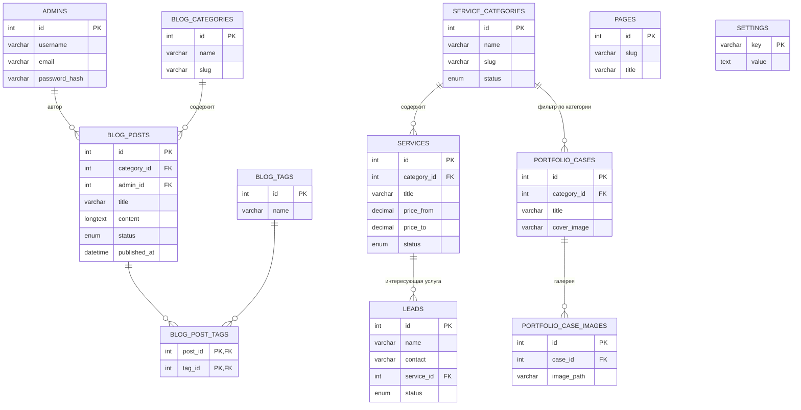

# Схема базы данных — web-service.studio

Версия: 1.0 · Дата: 27.08.2026 · Соответствует ТЗ v1.13

Готовый файл миграции: `db_schema_webservice_studio.sql` (отправлен пользователю). Ниже — обоснование структуры, чтобы решения не пришлось восстанавливать по одному SQL-файлу.

## ER-диаграмма

`PAGES` и `SETTINGS` не связаны внешними ключами с остальными таблицами — намеренно, это независимые справочники.

## Таблицы и обоснование решений

**admins** — учётки для входа в `/admin`. Пароль только хэшем (`password_hash()` на этапе разработки, а не в дампе — см. примечание в конце SQL-файла). Поля `failed_login_attempts`/`locked_until` — под требование ТЗ 2.4 «ограничение попыток входа».

**service_categories** — одна таблица категорий используется и разделом «Услуги», и «Портфолио», потому что по ТЗ (п.4.2) портфолио фильтруется именно «по категории услуги» — так сущность не дублируется, и оба раздела всегда говорят об одних и тех же категориях. Seed: Розробка сайтів, Розробка додатків під Android, Арбітраж трафіку, Адміністрування доменів та сайтів (на украинском — основной язык сайта, см. ТЗ п.3.1).

**services** — вайтпейдж/лендинги/клоакинг реализованы как три отдельные услуги внутри категории «Арбітраж трафіку», а не как отдельная сущность «подуслуга» — это проще для админки и полностью покрывает требование ТЗ. `price_from`/`price_to`/`price_note` оставлены пустыми в seed-данных: по решению из переписки (ТЗ п.4.3) точные тарифы заказчик проставит сам через админку, когда она будет готова — на старте это ориентировочные среднерыночные значения, которые вводятся вручную через интерфейс, а не через миграцию.

**blog_categories / blog_tags / blog_posts / blog_post_tags** — классическая схема блога с черновиками (`status`), SEO-полями на уровне статьи (title/description/og-image — ТЗ п.4.1) и связью многие-ко-многим с тегами.

**portfolio_cases / portfolio_case_images** — обложка кейса хранится прямо в `portfolio_cases.cover_image`, дополнительные фото галереи — в отдельной таблице (кейсов немного, фото на кейс может быть несколько — простой список с сортировкой).

**leads** — заявки с формы связи. `service_id` — та услуга, которую выбрал/предзаполнил пользователь кнопкой «Заказать» (ТЗ п.4.3–4.4); `telegram_notified` — техническое поле, чтобы видеть, ушло ли уведомление в Telegram-канал (на случай сбоя Bot API — заявка в БД всё равно сохранится). `ON DELETE SET NULL` на `service_id` — история заявок не должна пропадать, если услугу потом удалят.

**pages** — лёгкая CMS-таблица для статических, но редактируемых страниц («О студии», «Політика конфіденційності» и т.п.), чтобы и они не требовали правки кода.

**settings** — key-value для контактов/соцсетей/SEO по умолчанию (ТЗ п.4.5 «базовые настройки сайта»). Уже засеяны подтверждённые контакты: email, Facebook, Instagram, Telegram, WhatsApp (ТЗ п.1.5).

## Технические примечания

- Кодировка `utf8mb4` везде — полная поддержка эмодзи и всех символов кириллицы/латиницы без сюрпризов.
- Все `slug`-поля уникальны и предназначены для человекопонятных URL (ТЗ, раздел 5 — SEO).
- Языковых полей в схеме нет намеренно: сайт одноязычный (украинский), EN-версия — отдельная копия всего сайта, а не мультиязычные строки в БД (решение зафиксировано в ТЗ п.3.1).
- Схема проверена статически (парность скобок, соответствие внешних ключей существующим таблицам, порядок `CREATE TABLE` с учётом зависимостей). Живого MySQL/MariaDB-движка в этой рабочей среде поднять не удалось — нет доступа ни к пакетным репозиториям, ни к Docker-демону, ни к внешним хостам, — поэтому рекомендуется прогнать дамп один раз на локальном/тестовом окружении разработчика перед использованием на боевом хостинге, как обычную проверочную процедуру.
